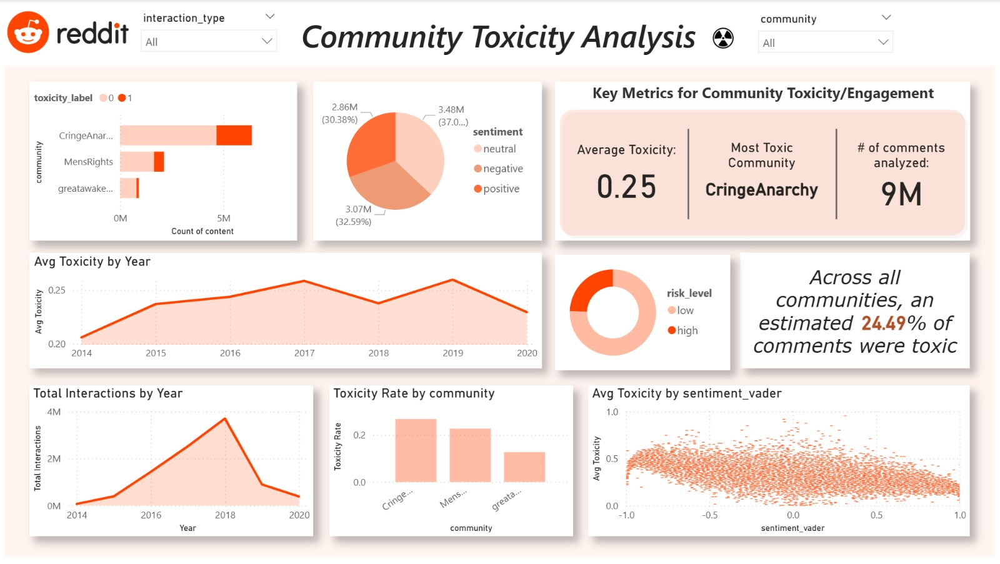

# DSAI3202 — Project Phase 1
## Toxicity Monitoring on Reddit Communities
#### Members: Lynn Younes 60107070 & Urooj Shah 60300832
---
### Introduction
People online post:  
- insults  
- threats  
- questionable opinions like "mint choco chip ice cream is good"
This creates unsafe environments and forces moderators to experience **rapid aging buffs**.

So we built a system to detect toxicity in real-time.

### Basically us, reading the dataset:

**Dataset:** "User123 said: *you absolute waste of oxygen—*"  
**Us:**  


This project builds an end-to-end cloud analytics pipeline that ingests Reddit community data, cleans and transforms it inside an Azure Lakehouse, engineers advanced NLP features, and visualizes toxicity trends using Power BI.

The goal is to measure community toxicity, sentiment behaviour, and interaction risks using modern text analytics techniques and scalable cloud infrastructure, while Reddit invents new slang every 3 business days.
*(A.K.A: We built a robot that reads comments so we don't have to. Because mental health.)*


The pipeline uses:
- Azure Data Lake Gen2 (Bronze → Silver → Gold)
- Azure Databricks (PySpark) for transformations
- ML-based text feature engineering
- Power BI for dashboards and exploratory analysis

---

# Reddit API Access  
We use **PRAW**.  
PRAW is like:

> "Reddit, can we please have… one (1) comment? Please? Gently?"

Reddit free tier lets us send **100 requests/min**, which works perfectly because:

- we're students  
- our budget is please 
- and we are NOT paying for API calls when we can barely pay for lunch

---

### README Organization
This README is organized as follows:

1. [Project Directory Structure](#1-project-directory-structure)  
2. [Lakehouse Architecture](#2-lakehouse-architecture)  
   - I. [Bronze Layer](#i-bronze-layer)  
   - II. [Silver Layer](#ii-silver-layer)  
   - III. [Gold Layer](#iii-gold-layer)
3. [Final Dataset Schema](#v-final-dataset-schema)
4. [Power BI Dashboard](#3-power-bi-dashboard)   
5. [Challenges](#4-challenges)
6. [Conclusion](#4-conclusion)

---
### 1) Project Directory Structure
Below is the structure of this GitHub repository:
```
dsai3202-toxicity-monitor/
│
├── data/
│   ├── sample_cringeanarchy.json        # Sample data for demonstration
│   ├── sample_greatawakening.json
│   └── sample_mensrights.json
│
├── img/
│   ├── bronze_layer.png
│   ├── silver_layer.png
│   ├── gold_layer.png
│   ├── lakehouse_directory.png
│   └── Reddit EDA Dashboard.jpg
│
├── notebooks/
│   └── MADOC gold feature engineering.ipynb   # Main Databricks notebook where cleaning and feature engineering happens
│
├── src/
│
├── README.md                         # This file
└── requirements.txt                  # Python dependencies

```

### 2) Lakehouse Architecture
Our architecture follows the holy trinity of data engineering: **Bronze → Silver → Gold**,  
also known as:  
**"Raw Chaos → Slightly Less Chaos → Data Your Professor Might Actually Look At."**

#### I. Bronze Layer
The Bronze layer is where **raw, unfiltered, fully-feral data goes to chill**.

Source of data?
Remember that dataset paper website from the proposal the MADOC project?  
They had datasets from:
- Reddit  
- Bluesky  
- and some other platform that felt like a social network from the multiverse  

So from their massive chaotic archive, we picked a few communities:
- **r/cringe**  
- **r/greatawakening**  
- **r/mensrights**  
*(Fun fact: the fat people subreddit dataset got corrupted. Probably a sign from the universe.)*

Process:
- Created **Storage Account**, **Lakehouse**, and **raw/silver/gold** folders (just like the labs).
- Used **Azure Machine Learning** to run `wget` + `azcopy` to haul the data from the MADOC site to our Lakehouse.
- Dropped the untouched parquet files into **bronze/reddit/**.

Essentially, the Bronze layer is:

**Bronze layer be like:**  


#### II. Silver Layer

The Silver layer is where the data stops being wild Reddit creature and starts becoming a citizen.

Since all MADOC subreddit files were already in **Parquet** (bless whoever made that decision),  
we didn't have to fight with CSVs, JSONs, or existential dread.

Using **Azure Data Factory**, we:
- created a pipeline  
- moved each subreddit parquet into **silver/reddit/**  
- merged them into one unified Reddit folder  
- performed basic structural normalization  

Silver layer = Bronze, but after drinking water and going to therapy.

#### III. Gold Layer

Welcome to the **Gold Layer**, where the dataset hits its personal villain arc.

In our Databricks notebook (yes, the one that slowly consumed our sanity), we:
- loaded the clean Silver data  
- added some simple but useful features like:
  - `comment_length`
  - `num_capital_letters`
  - `num_punctuation`
  - anything else that screams "this comment might be toxic"  
- didn't bother with SBERT embeddings because:
  - MADOC already comes with toxicity + sentiment labels  
  - and we're not trying to melt our Azure credits

Gold outputs stored under:  
**gold/reddit_features/**

### Final Dataset Schema
### Final Dataset Schema  

Our final cleaned dataset includes:

| Feature | Description |
|--------|-------------|
| `comment_id` | Unique ID of the comment |
| `platform` | Always Reddit for Phase 1 |
| `subreddit` | Source community |
| `timestamp` | When the chaos was posted |
| `clean_text` | Sanitized comment text |
| `toxicity_score` | Provided by MADOC's existing model |
| `sentiment_score` | Already included in source metadata |
| `comment_length` | Hand-engineered feature |
| `num_capital_letters` | Because YELLING = Suspicious |
| `num_punctuation` | Emotional instability counter |
| other metadata… | because Reddit loves metadata |

### Power BI Dashboard
For visualization:
- Connected Power BI Desktop directly to Azure (Data Lake storage).  
- Loaded the dataset from **gold/reddit_features/**.  
- Built dashboards showing:
  - toxicity levels  
  - sentiment overview  
  - subreddit comparisons  
  - comment behavior trends  

It's basically **Google Analytics for Drama™.**



Power BI be like:  
"Your subreddit is 63% more toxic this week ✨. Maybe log off."

### Challenges
We encountered many bosses in this RPG adventure, including:

- Parquet files judging us silently  
- Azure ML refusing `wget` until we convinced it  
- Corrupted subreddit file (RIP to the fat people dataset 🕊️)  
- Data Factory pipelines running only when properly bribed  
- Spark notebooks that said "Im gonna stop you right there…"
- Subreddits that emotionally damaged us during EDA  
- The moment we realized some comments should stay unread forever  

### Conclusion
In Phase 1, we successfully:

- built the full **Bronze → Silver → Gold** data pipeline  
- ingested real Reddit community datasets from MADOC  
- cleaned and engineered features in Databricks  
- generated a final usable dataset in **gold/reddit_features**  
- built a connected Power BI dashboard to visualize toxicity trends  

We laughed, we cried, we begged Azure to stop charging us.

Phase 2 will bring:
- Real-time ingestion (pray for us)  
- Live streaming dashboards  
- Alerting when users are *extra* feral  
- Possibly a built-in "bro seek therapy" classifier


